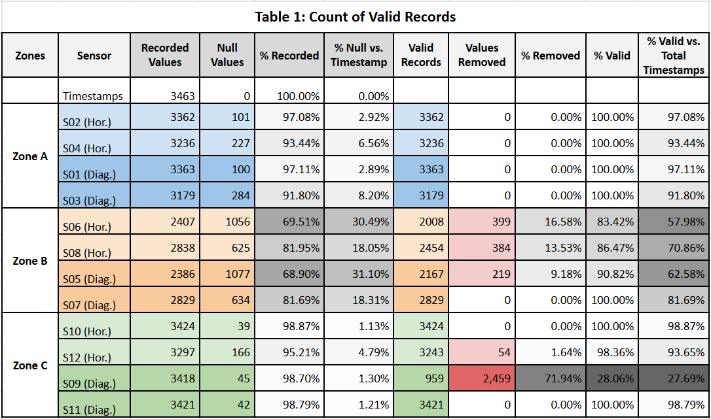
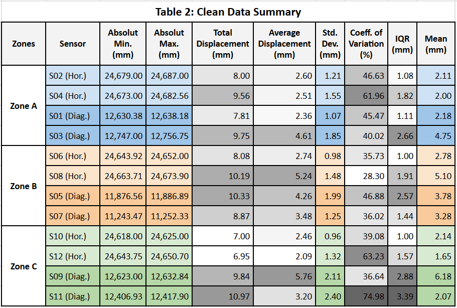
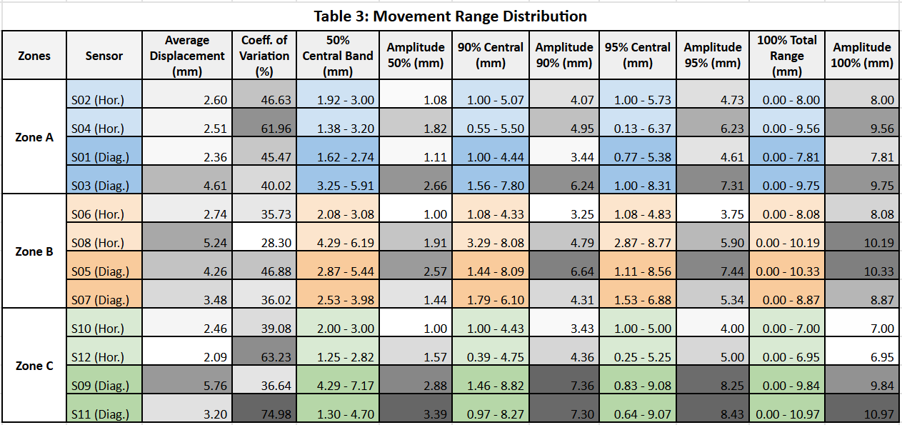

# Long-Term Structural Displacement Monitoring
## Data Pipeline & Environmental Correlation Analysis for Heritage Masonry Vaults

> **Structural Health Monitoring (SHM) | Python Data Pipeline | Statistical Analysis | Environmental Correlation**

---

## Table of Contents

| Section | What it covers |
|---------|---------------|
| [Repository Structure](#repository-structure) | Folder and file organization |
| [Project Overview](#project-overview) | Context, objective, and monitoring period |
| [The Structure](#the-structure) | Structural typology, zones, and sensor layout |
| [Technical Stack](#technical-stack) | Tools and libraries used |
| [Pipeline Architecture](#pipeline-architecture) | End-to-end data flow from raw CSVs to results |
| [Notebooks Guide](#notebooks-guide) | What each notebook does and what it showcases |
| [Key Engineering Decisions](#key-engineering-decisions-in-the-analysis) | The judgment calls behind the methodology |
| [Key Results](#key-results) | Main findings and structural diagnosis |
| [Quantitative Results](#quantitative-results) | Tables: cleaning outcomes and displacement statistics |
| [What This Project Demonstrates](#what-this-project-demonstrates) | Skills and competencies illustrated |
| [Data Confidentiality](#data-confidentiality) | Anonymization approach |

---

## Repository Structure

```
structural-displacement-monitoring/
├── README.md                           ← Project overview, methodology, results
├── ANALYSIS_REPORT.md                  ← Full anonymized technical report with
│                                         all visualizations and interpretations
├── assets/
│   └── tables/                         ← Table images referenced in README and report
│       ├── table_01_valid_records.png
│       ├── table_02_clean_summary.png
│       └── table_03_movement_ranges.png
├── data/
│   ├── raw/                            ← Monthly CSVs per sensor (anonymized sample)
│   └── processed/
│       └── unified_clean_data.csv      ← Merged and cleaned dataset (anonymized)
├── notebooks/
│   ├── 01_data_ingestion.ipynb
│   ├── 02_data_cleaning.ipynb          ← Parameterized per sensor
│   ├── 03_statistical_analysis.ipynb
│   ├── 04_correlation_analysis.ipynb
│   └── 05_sensor_individual_analysis.ipynb
└── outputs/
    └── tables/                         ← Summary Excel tables
        ├── 00_raw_summary.xlsx
        ├── 01_nan_table_raw.xlsx
        ├── 02_clean_summary.xlsx
        ├── 03_movement_ranges.xlsx
        └── comparative_diag_vs_horiz.xlsx
```

---

## Project Overview

Complete **data engineering and analysis pipeline** applied to a real-world Structural Health Monitoring (SHM) deployment on heritage masonry vaults. Over a **10-month continuous monitoring period**, 12 laser displacement sensors recorded structural deformation at 15-minute intervals across three structural zones, generating over 40,000 timestamped observations.

The goal was not simply to process sensor data — it was to **extract engineering-relevant conclusions** from noisy, real-world IoT data: determining whether displacements were elastic and thermally driven, identifying zones of higher mechanical stress, and establishing data-driven alert thresholds for anomaly detection.

This is the **second reporting cycle** of an ongoing SHM project. The first cycle established a visual baseline; this cycle applies formal statistical methods to validate and extend those findings.

---

## The Structure

The monitored structures are **Gaussian ceramic vaults** — thin-shell reinforced ceramic arch systems designed by Uruguayan engineer **Eladio Dieste**. The arches transfer loads through compression, making their response to thermal expansion and environmental gradients a critical monitoring target.

| Zone | Sensors | Measurement Axes |
|------|---------|-----------------|
| Zone A | S01 – S04 | Diagonal (arch deformation) + Horizontal (lateral spread) |
| Zone B | S05 – S08 | Diagonal + Horizontal |
| Zone C | S09 – S12 | Diagonal + Horizontal |

Environmental variables — **temperature, relative humidity, atmospheric pressure** — recorded in parallel for correlation analysis.

---

## Technical Stack

| Tool | Role |
|------|------|
| **Python** | Full pipeline: ingestion, cleaning, analysis, visualization |
| **Pandas / NumPy** | Data manipulation, statistical computation |
| **SciPy** | Statistical modelling |
| **Matplotlib / Seaborn** | All visualizations |
| **scikit-learn** | MinMaxScaler for normalized temporal comparisons |
| **ThingsBoard** | IoT platform (data source — cloud dashboard) |
| **Jupyter Notebooks** | Analysis environment |
| **Excel** | Summary tables for client reporting |

---

## Pipeline Architecture

```
Raw CSVs (monthly, per sensor)
        │
        ▼
01_data_ingestion.ipynb
   → Merge monthly files into unified DataFrame
   → Timestamp parsing and format standardization
   → Export by zone and by individual sensor
        │
        ▼
02_data_cleaning.ipynb  [parameterized per sensor]
   → Phase 1: Geometric filter — physically impossible values removed
              (e.g. readings violating known sensor installation distances)
   → Phase 2: Chauvenet Criterion — probabilistic outlier detection
              (flags values statistically unlikely to belong to the sample population)
   → Phase 3: IQR filter on Chauvenet-cleaned data — iterative k-factor selection
              (k iterated until elimination % stabilizes between two consecutive values)
   → Output: validated clean DataFrame per sensor
        │
        ▼
03_statistical_analysis.ipynb
   → Descriptive statistics (mean, std, CV, IQR, percentiles P1→P99)
   → Movement classification per sensor (amplitude, dispersion, variability)
   → Comparative summary tables across all sensors
        │
        ▼
04_correlation_analysis.ipynb
   → Pearson correlation: each sensor vs Temperature, Humidity, Pressure
   → Correlation matrices per zone and per axis group (horizontal vs diagonal)
   → Normalized temporal overlay plots for visual validation
        │
        ▼
05_sensor_individual_analysis.ipynb  [parameterized — runs for all 12 sensors]
   → Per-sensor: temporal evolution, histogram of real values,
     histogram of relative displacements, percentile bands
   → Production-quality figures for technical report
        │
        ▼
ANALYSIS_REPORT.md
   → Full anonymized technical report
   → All visualizations with engineering interpretations
   → Structural diagnosis, zone-level findings, and alert threshold definitions
```

---

## Notebooks Guide

Each notebook is a self-contained pipeline stage, designed to run sequentially.

---

### `01_data_ingestion.ipynb`
**What it does:** Loads monthly CSV files from the IoT platform, merges them into a unified DataFrame, parses timestamps, and exports subsets by zone and sensor.

**What it showcases:** Multi-file ingestion with Pandas; timestamp standardization; structured data partitioning; awareness of data provenance across files with varying format quirks.

---

### `02_data_cleaning.ipynb`
**What it does:** Applies a three-phase cleaning strategy per sensor. Phase 1 removes geometrically impossible values. Phase 2 applies the **Chauvenet Criterion** — a probabilistic test flagging values statistically unlikely to belong to the sample. Phase 3 applies an **iterative IQR filter** on the Chauvenet-cleaned data, with multiplier `k` iterated until elimination percentage stabilizes. Each sensor is processed independently and exports one clean CSV.

**What it showcases:**
- Sequential design: geometric filter eliminates hardware impossibilities; Chauvenet removes statistical outliers; IQR defines the valid structural operating envelope — each phase targets a distinct type of noise
- Iterative k-factor selection prevents both over-filtering (losing real structural peaks) and under-filtering (retaining sensor noise)
- k-factor differs across sensors (k=1 to k=5) — per-sensor individualization based on data quality and physical installation context
- Decision trail fully preserved: each phase logs records removed, percentage, and interpretation

> This notebook is the technical core of the project. The methodology choices here are what separate an engineering analysis from a generic data cleaning script.

---

### `03_statistical_analysis.ipynb`
**What it does:** Computes full descriptive statistics on clean data — mean, std, CV, IQR, percentile bands P1→P99. Generates comparative charts across all sensors. Exports summary tables to Excel.

**What it showcases:** Movement classification framework derived from the data (not assumed); CV as the primary cross-zone comparability metric; percentile-band interpretation where P50 = structural neutral, P95 = operational limit, P100 = historical maximum — each with engineering meaning.

---

### `04_correlation_analysis.ipynb`
**What it does:** Computes Pearson correlation between each sensor and environmental variables. Generates heatmaps per zone and per axis group. Produces normalized temporal overlays for visual validation.

**What it showcases:** Correlation results linked to physical behavior — not reported as abstract numbers; identification of humidity correlation as a statistical artifact of the temperature/humidity inverse cycle rather than an independent mechanical driver; cross-sensor correlation to identify zones acting as a mechanical unit.

---

### `05_sensor_individual_analysis.ipynb`
**What it does:** Parameterized notebook (single `sensor` variable controls the run) generating the full visual suite per sensor: temporal evolution with percentile bands, histogram of absolute values, histogram of relative displacements, and statistical summary.

**What it showcases:** Parameterized design — no code duplication across 12 sensors; distinction between absolute distance (raw laser reading) and relative displacement (structural movement from contracted baseline); production-quality figures suitable for formal technical reporting.

---

## Key Engineering Decisions in the Analysis

### 1. Three-phase cleaning strategy
Separating geometric, probabilistic, and statistical filters ensures each type of bad data is handled by the most appropriate method — not discarded by a single blunt rule. A pure IQR filter applied blindly would eliminate real structural events; a pure Chauvenet filter would miss systematic sensor drift. The sequence matters.

### 2. Sequential Chauvenet → IQR pipeline
Both methods applied to all 12 sensors, in order:
- **Chauvenet (Step 1):** Removes population outliers — values with probability < 1/(2n) of belonging to the sample. Removed 0–1.87% per sensor.
- **IQR (Step 2):** Applied to Chauvenet-cleaned data. Defines the valid structural operating range. k-factor selected individually per sensor by iterating until elimination % stabilizes. Removed 0–8.87% per sensor.

The two methods are complementary: Chauvenet removes statistical anomalies; IQR defines the physical operating envelope.

### 3. Relative displacement vs. absolute distance
Sensors measure **absolute distance** (e.g. 12,632 mm). The structural variable of interest is **relative displacement** — change from the minimum reference position. All movement analysis uses this derived variable; zero means most contracted state.

### 4. S09 treated as reference-only
With only 28% valid data due to connectivity failures, S09 was neither excluded nor weighted equally — it was explicitly flagged as a **reference node** for directional symmetry checks only. This is a data integrity decision with documented reasoning, not a filter artifact.

### 5. Alert thresholds derived from empirical distributions
- **Yellow alert:** displacement exceeds the sensor's P95 historical range — extreme but potentially elastic event, verify nocturnal return.
- **Red alert:** displacement exceeds mean + 3σ — indicates a non-thermal cause or change in structural stiffness.
- **Hysteresis alert:** structure fails to return to nocturnal baseline (04:00–06:00 AM) — potential permanent deformation.

---

## Key Results

| Finding | Value |
|---------|-------|
| Dominant displacement driver | Temperature — Pearson r = 0.7–0.9 across most sensors |
| Humidity / Pressure influence | Negligible (r < 0.4) — humidity correlation is an artifact of the temp/humidity inverse cycle |
| Maximum recorded displacement | 10.97 mm (Zone C, diagonal axis) |
| Typical daily IQR range | 1.0–2.9 mm depending on zone and axis |
| Structural diagnosis | Elastic, thermally cyclic — no permanent deformation detected |
| Daily recovery window | 04:00–06:00 AM consistently across all sensors |
| Thermal lag confirmed | Displacement peaks trail temperature peaks → thermal inertia of masonry mass |
| Zone C morning anomaly | Abrupt increase at 08:00–10:30 AM → operational load superimposed on solar heating |

---

## Quantitative Results

### Data Availability & Cleaning Pipeline

> **Note on sensor labels:** Images use original project identifiers (DI-001 through DI-012), corresponding to S01–S12 / Zone A–C in the published code. See [The Structure](#the-structure).



- **Zone A** retains 91–97% of registered values with zero IQR eliminations — cleanest signal in the system.
- **Zone B** retains only 57–62% of total timestamps on two sensors, driven by a December 2025 connectivity outage confirmed by simultaneous gaps across all four zone sensors.
- **S09 (Zone C)** had 71.94% of values eliminated — retained as reference node only.

---

### Clean Data — Displacement Statistics

Statistics after full Chauvenet + IQR cleaning. "Movimiento Promedio" = mean relative displacement from structural minimum. CV = coefficient of variation — primary metric for cross-zone comparability independent of absolute magnitude.



- Zone A has the lowest standard deviations (1.07–1.85 mm) — highest structural predictability in the system.
- S08 (Zone B, horizontal): highest average movement (5.24 mm) with the lowest CV (28.3%) — moves significantly but with extreme rhythmic consistency, the primary thermal expansion absorption point in Zone B.
- S11 (Zone C, diagonal): highest total movement (10.97 mm) and highest CV (74.98%) — the most dynamically loaded and least predictable point in the system.

---

### Movement Range Distribution by Percentile Band

Four bands per sensor: 50% central (IQR — daily structural baseline), 90% central (seasonal variation), 95% central (engineering operational limit), 100% total (historical maximum). These bands directly define the alert thresholds.



- IQR band (50% central) ranges 1.00–2.88 mm across all sensors — the structural "heartbeat" under normal daily conditions.
- P95 band serves as the **Yellow Alert threshold**: exceeding it triggers a nocturnal return verification.
- S11 shows the largest P95→P100 gap (9.07 mm → 10.97 mm), confirming its peak displacements are genuine structural events, not noise.

---

## What This Project Demonstrates

- **End-to-end data pipeline** from raw IoT CSV to structured statistical output and formal technical report
- **Domain-informed data cleaning**: each decision is grounded in structural engineering logic, not statistical convention alone
- **Physical interpretation of statistics**: Pearson r, IQR, CV and percentile bands always linked to structural behavior — never presented as abstract numbers
- **Multi-sensor comparative analysis**: 12 sensors, 3 zones, 2 axes — synthesized into coherent zone-level and system-level conclusions
- **Alert system design** derived from empirical data distributions, not regulatory defaults

---

## Data Confidentiality

Conducted under a professional engagement. Data published here has been **anonymized**: client and location references removed, sensor identifiers relabeled (S01–S12), zone labels generalized (Zone A / B / C). A representative data sample is provided; the full dataset is not public. Methodology, code, and results are fully representative of the original work.

---

## Author

**Veronica C. Serrano**
M.Sc. Civil Engineer — Structures and Materials
Data Analysis | SHM | Python Pipelines | Applied Engineering

[GitHub](https://github.com/vcserrano248) · [Portfolio](https://vcserrano248.github.io)
